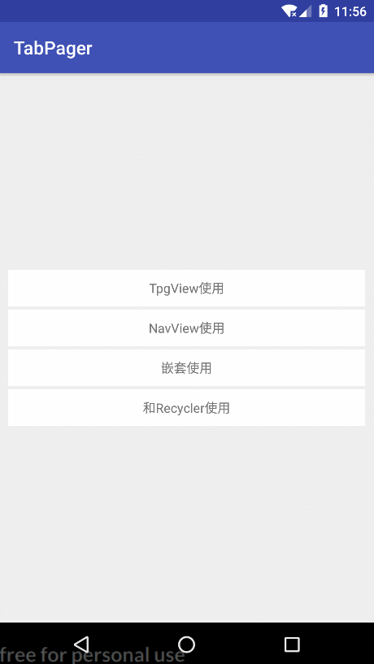

# `TabPager`

  

> `TabPager`不仅集成了`TabLayout`和`ViewPager`为顶部选项卡页面，也集成了`RadioGroup`和`ViewPager`为底部导航栏页面，还封装了根据具体页面根据不同的加载状态而显示不同页面的功能，也可以自定义这些页面和其他一些属性。如果某个页面加载数据不成功，切换到其他页面再回来时，框架会自动调用重试加载功能；如果加载成功了，则不再重试加载。

> 更新内容请参考[更新日志](#user-content-5-更新日志)

### 1. 运行效果

* 屏幕截图（`gif`录制卡顿，实际运行流畅）：



* Demo下载体验，[`TabPager`](https://fir.im/tpq72p) ，或者扫描二维码下载

  


### 2. 依赖

```groovy
dependencies {
  compile 'com.yhy.widget:tabnav:latestVersion'
}
```

### 3. 使用说明

* 顶部选项卡页面控件[**TpgView**](./doc/TpgView.md)
* 底部导航栏页面控件[**NavView**](./doc/NavView.md)

### 4. 嵌套使用

> 嵌套使用使用方法跟普通使用一样，唯一需要注意的是创建适配器时的`FragmentManager`，如果是一级`Fragment`的话，需要传入`getSupportFragmentManager()`，否则只能是`getChildFragmentManager()`

```java
//mAdapter = new PagersAdapter(getFragmentManager());
/*
//这里需要用getChildFragmentManager()

getChildFragmentManager()是fragment中的方法, 返回的是管理当前fragment内部子fragments的manager.
getFragmentManager()在activity和fragment中都有.
在activity中, 如果用的是v4 support库, 方法应该用getSupportFragmentManager(),返回的是管理activity中fragments的manager.
在fragment中, 还叫getFragmentManager(), 返回的是把自己加进来的那个manager.
也即, 如果fragment在activity中, fragment.getFragmentManager()得到的是activity中管理fragments的那个manager.如果fragment是嵌套在另一个fragment中, fragment.getFragmentManager()得到的是它的parent的getChildFragmentManager().
总结就是: getFragmentManager()是本级别管理者, getChildFragmentManager()是下一级别管理者.
这实际上是一个树形管理结构.
*/
mAdapter = new PagersAdapter(getChildFragmentManager());
tpgView.setAdapter(mAdapter);
```

---

### 5. 更新日志

* 1.1.5

  * `TpgView`设置每个`tab`的背景图

    > 在布局文件中使用

    ```xml
    <com.yhy.tabnav.widget.TpgView
       ...
       app:tab_background="@drawable/tab_background_selector" />
    ```

    > 在代码中设置

    ```java
    tvContent.setTabBackground(R.drawable.tab_background_selector);
    ```

  * `TpgView`自定义`tab`控件

    > 重写适配器`TpgAdapter`的`View getCustomTabView(int position, String data)`方法，返回具体的`tab`控件即可
    >
    > 注意：此时可以不重写`String getTitle(position)`方法

    ```java
    private class PagersAdapter extends TpgAdapter<String> {
        public PagersAdapter(FragmentManager fm, PagerConfig config) {
            super(fm, Arrays.asList(TABS), config);
        }

        @Override
        public PagerFace getPager(int position) {
            return PagerFactory.create(position);
        }

        @Override
        public View getCustomTabView(int position, String data) {
            TextView tv = (TextView) LayoutInflater.from(TpgCustomActivity.this).inflate(R.layout.tab_custom_view, null);
            tv.setText(data);
            return tv;
        }
    }
    ```

    > 注意：`TpgAdapter`中的`View getCustomTabView(int position, String data)`和`String getTitle(position)`两个方法必须二选一重写，前者用于自定义`tab`控件，后者则普通情况下使用！！

* 1.1.4

  > 修复`NavView`获取导航栏高度属性的`bug`


* 1.1.3
  * 提供自定义`ViewPager`功能，只需要在`TpgView`或者`NavView`代码块中设置自定义好的`ViewPager`即可，不过必须实现`Pager`接口

    > 这是一个自适应高度的`ViewPager`，实现`Pager`接口

    ```java
    public class MostHeightViewPager extends ViewPager implements Pager {

      // 定义辅助类对象
      private PagerHelper mHelper;

      public MostHeightViewPager(Context context) {
        this(context, null);
      }

      public MostHeightViewPager(Context context, AttributeSet attrs) {
        super(context, attrs);
        mHelper = new PagerHelper(this);
      }

      @Override
      public ViewPager getViewPager() {
        return this;
      }

      @Override
      public void setScrollAble(boolean scrollAble) {
        mHelper.setScrollAble(scrollAble);
      }

      @Override
      public boolean onSuperInterceptTouchEvent(MotionEvent ev) {
        return super.onInterceptTouchEvent(ev);
      }

      @Override
      public boolean onSuperTouchEvent(MotionEvent ev) {
        return super.onTouchEvent(ev);
      }

      @Override
      protected void onMeasure(int widthMeasureSpec, int heightMeasureSpec) {
        // ...
      }

      private int measureHeight(int measureSpec, View view) {
        // ...
      }
    }
    ```

    > 使用该自定义的`ViewPager`

    ```xml
    <com.yhy.tabnav.widget.TpgView
      android:id="@+id/tv_content"
      android:layout_width="match_parent"
      android:layout_height="match_parent"
      app:expand_visible="gone"
      app:tab_mode="fixed"
      app:text_color="#666"
      app:text_size="16sp"
      app:text_visible="visible">

      <!--在这里将定义好的ViewPager设置进来即可-->
      <com.yhy.tabnav.widget.pager.HighestViewPager
          android:layout_width="match_parent"
          android:layout_height="match_parent" />
    </com.yhy.tabnav.widget.TpgView>
    ```

  * 将`TpgAdapter`改为接收泛型数据，更加便捷实现获取页面标题的功能

    > 设置适配器时

    ```java
    public class PagersAdapter extends TpgAdapter<User> {
      // ...
      @Override
      public CharSequence getTitle(int position, User data) {
        return data.name;
      }
    }
    ```


* 1.1.2

  * 修改四个修改页面状态的方法

    > 以下是上一个版本中的方法

    ```java
    /**
     * 将页面状态改为[加载中]
     */
    void onLoading();

    /**
     * 将页面状态改为[成功]
     */
    void onSuccess();

    /**
     * 将页面状态改为[空数据]
     */
    void onEmpty();

    /**
     * 将页面状态改为[错误]
     */
    void onError();
    ```

    > 分别修改为

    ```java
    /**
     * 将页面状态改为[加载中]
     */
    void tpgLoading();

    /**
     * 将页面状态改为[成功]
     */
    void tpgSuccess();

    /**
     * 将页面状态改为[空数据]
     */
    void tpgEmpty();

    /**
     * 将页面状态改为[错误]
     */
    void tpgError();
    ```

* 1.1.1

  * 修复子页面获取不到根页面的bug。

    > 子页面调用根页面的xxx方法。

    ```java
    getRoot().xxx(); // 不再是之前的mRoot.xxx();  
    ```


* 1.1.0

  * 实现真正的懒加载，当页面可见时才初始化当页数据和事件。

  * 不在提供`shouldLoadDataAtFirst()`方法，在懒加载中自动初始化当页数据和事件。

  * 将`TpgView`的适配器中一些可共用的方法抽取到`TpgAdapter`中；`NavView`同理抽取到`NavAdapter`中。

  * 进一步优化`NavView`中的事件触发逻辑，解决`RadioGroup`和`ViewPager`事件互相调用的问题。

  * 将原本`TpgFragment`中实现页面相关的方法抽取成接口，这样就可以定义自己的`CustomeTpgFragment`。适用于已经有自己的`BaseFragment`的情况，直接将`CustomeTpgFragment`集成与`BaseFragment`，并参照`TpgFragment`实现`PagerFace<RT>`接口。

    > 详情请参照`TpgFragment`，使用助手类`PagerHelper`来完成相关配置。

    ```java
    public abstract class TpgFragment<RT> extends Fragment implements PagerFace<RT> {
        //当前Activity对象
        public Activity mActivity;
        //页面助手，用于创建各种View，比如错误页面等（必要）。便于自定义该页面时直接使用。
        private TpgHelper<RT> mHelper = new TpgHelper<>();

        /**
         * Fragment生命周期方法--创建
         *
         * @param savedInstanceState 保存的参数
         */
        @Override
        public void onCreate(@Nullable Bundle savedInstanceState) {
            super.onCreate(savedInstanceState);
            // 获取Activity
            getPagerActivity(getActivity());
        }

        /**
         * Fragment生命周期方法--依附到Activity
         *
         * @param context 上下文对象
         */
        @Override
        public void onAttach(Context context) {
            super.onAttach(context);
            // 为了避免Activity为空，这里需要再次通过context获取Activity
            getPagerActivity(context);
        }

        /**
         * Fragment生命周期方法--View创建
         *
         * @param inflater           布局映射器
         * @param container          容器
         * @param savedInstanceState 保存的参数
         * @return 真正显示的View
         */
        @Nullable
        @Override
        public View onCreateView(LayoutInflater inflater, @Nullable ViewGroup container, @Nullable Bundle savedInstanceState) {
            View view = onCreatePagerView(inflater, container, savedInstanceState);
            // 由于setUserVisibleHint方法再onCreateView之前执行，所以要实现懒加载的话，就再onCreateView方法中手动调用加载数据方法，并在setUserVisibleHint方法中判断是否显示
            shouldLoadData();
            return view;
        }

        /**
         * Fragment的显示或者隐藏
         * <p>
         * 必须在切换页面时手动调用
         * 这里的页面都用在ViewPager中，在FragmentPagerAdapter中已经主动触发
         *
         * @param isVisibleToUser 是否显示
         */
        @Override
        public void setUserVisibleHint(boolean isVisibleToUser) {
            super.setUserVisibleHint(isVisibleToUser);

            // 记录下当前状态（由于setUserVisibleHint方法再onCreateView之前执行，所以要实现懒加载的话，就再onCreateView方法中手动调用加载数据方法，并在setUserVisibleHint方法中判断是否显示）
            mHelper.onPagerVisible(this, isVisibleToUser);
        }

        /**
         * PagerFace接口方法--适配器中获取Fragment使用
         *
         * @return 当前Fragment
         */
        @Override
        public Fragment getFragment() {
            return this;
        }

        /**
         * PagerFace接口方法--设置根页面
         *
         * @param root 根页面
         */
        @Override
        public void setRoot(RT root) {
            mHelper.setRoot(root);
        }

        /**
         * 获取根页面
         *
         * @return 根页面
         */
        @Override
        public RT getRoot() {
            return mHelper.getRoot();
        }

        /**
         * PagerFace接口方法--设置页面参数
         *
         * @param config 页面参数
         */
        @Override
        public void setPagerConfig(PagerConfig config) {
            mHelper.setPagerConfig(config);
        }

        /**
         * PagerFace接口方法--获取当前Activity
         *
         * @param context 上下文对象
         */
        @Override
        public void getPagerActivity(Context context) {
            if (null == mActivity) {
                mActivity = mHelper.getPagerActivity(context);
            }
        }

        /**
         * PagerFace接口方法--创建Fragment真正显示的View
         *
         * @param inflater           布局映射器
         * @param container          容器
         * @param savedInstanceState 保存的参数
         * @return 真正显示的View
         */
        @Override
        public View onCreatePagerView(final LayoutInflater inflater, final ViewGroup container, final Bundle savedInstanceState) {
            return mHelper.onCreatePagerView(this, inflater, container, savedInstanceState);
        }

        /**
         * PagerFace接口方法--页面显示或隐藏时触发
         *
         * @param isVisible 是否显示
         */
        @Override
        public void onPagerVisible(boolean isVisible) {
            //页面显示时自动调用shouldLoadData()方法加载数据
            if (isVisible) {
                shouldLoadData();
            }
        }

        /**
         * PagerFace接口方法--获取加载中状态时的View
         *
         * @param inflater           布局映射器
         * @param container          容器
         * @param savedInstanceState 保存的参数
         * @return 加载中状态时的View
         */
        @Override
        public View getLoadingView(LayoutInflater inflater, ViewGroup container, Bundle savedInstanceState) {
            return mHelper.getLoadingView(inflater, container, savedInstanceState);
        }

        /**
         * PagerFace接口方法--获取空数据状态时显示的View
         *
         * @param inflater           布局映射器
         * @param container          容器
         * @param savedInstanceState 保存的参数
         * @return 空数据状态时显示的View
         */
        @Override
        public View getEmptyView(LayoutInflater inflater, ViewGroup container, Bundle savedInstanceState) {
            return mHelper.getEmptyView(this, inflater, container, savedInstanceState);
        }

        /**
         * PagerFace接口方法--获取错误状态时显示的View
         *
         * @param inflater           布局映射器
         * @param container          容器
         * @param savedInstanceState 保存的参数
         * @return 错误状态时显示的View
         */
        @Override
        public View getErrorView(LayoutInflater inflater, ViewGroup container, Bundle savedInstanceState) {
            return mHelper.getErrorView(this, inflater, container, savedInstanceState);
        }

        /**
         * PagerFace接口方法--初始化事件
         */
        @Override
        public void initListener() {
        }

        /**
         * PagerFace接口方法--主动加载数据
         */
        @Override
        public void shouldLoadData() {
            mHelper.shouldLoadData();
        }

        /**
         * PagerFace接口方法--重新重新加载数据
         *
         * @param args 携带的参数
         */
        @Override
        public void reloadData(Bundle args) {
        }

        /**
         * PagerFace接口方法--将页面切换为加载中状态
         */
        @Override
        public void onLoading() {
            mHelper.onLoading();
        }

        /**
         * PagerFace接口方法--将页面切换为成功状态
         */
        @Override
        public void onSuccess() {
            mHelper.onSuccess();
        }

        /**
         * PagerFace接口方法--将页面切换为空数据状态
         */
        @Override
        public void onEmpty() {
            mHelper.onEmpty();
        }

        /**
         * PagerFace接口方法--将页面切换为错误状态
         */
        @Override
        public void onError() {
            mHelper.onError();
        }
    }
    ```

- 1.0.6

  - `TpgFragment`加入RT泛型

    > 在`TpgFragment`内部保存`TpgView`或者`NavView`的根`Activity`或者`Fragment`。只需要在设置适配器时传入泛型，并调用`setRoot(RT root)`方法，就可以在每一个子页面获取到根页面的引用，进而调用根页面的方法

    ```java
    //改变一下适配器的getPager(int position)方法
    @Override
    public TpgFragment<TpgActivity> getPager(int position) {
      //创建页面
      TpgFragment<TpgActivity> pager = new PagerA<>();
      //设置根页面
      pager.setRoot(TpgActivity.this);
      return pager;
    }

    //然后，你就可以在PagerA页面中直接调用TpgActivity中的方法了，哈哈~
    mRoot.xxx();
    ```

  - 在`TpgView`的选项卡栏左边添加说明文字

    > 比如“请选择：”等。。这种`UI`不常见。。不过有些变态设计总会玩些非主流（坑爹啊:sob:）
    >
    > 具体属性设置如下：

    ```xml
    <!--是否显示Tab栏TextView，默认为：GONE-->
    <attr name="text_visible" format="integer">
      <enum name="visible" value="0"/>
      <enum name="invisible" value="4"/>
      <enum name="gone" value="8"/>
    </attr>
    <!--Tab栏TextView内容-->
    <attr name="text_text" format="reference|string"/>
    <!--Tab栏TextView字体颜色，默认为：#aaff4400-->
    <attr name="text_color" format="reference|color"/>
    <!--Tab栏TextView字体大小，默认为：14sp-->
    <attr name="text_size" format="reference|dimension"/>
    <!--Tab栏TextView左侧边距，默认为：8dp-->
    <attr name="text_margin_left" format="reference|dimension"/>
    <!--Tab栏TextView右侧边距，默认为：8dp-->
    <attr name="text_margin_right" format="reference|dimension"/>
    ```

- 1.0.5

  > 加入`NavView`框架

### 句终

> 哈哈。。
